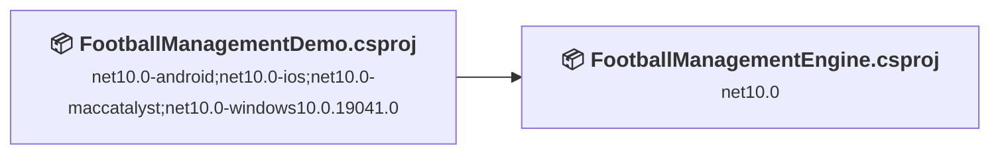
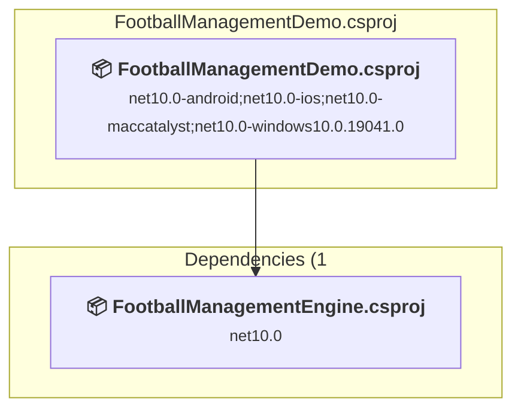
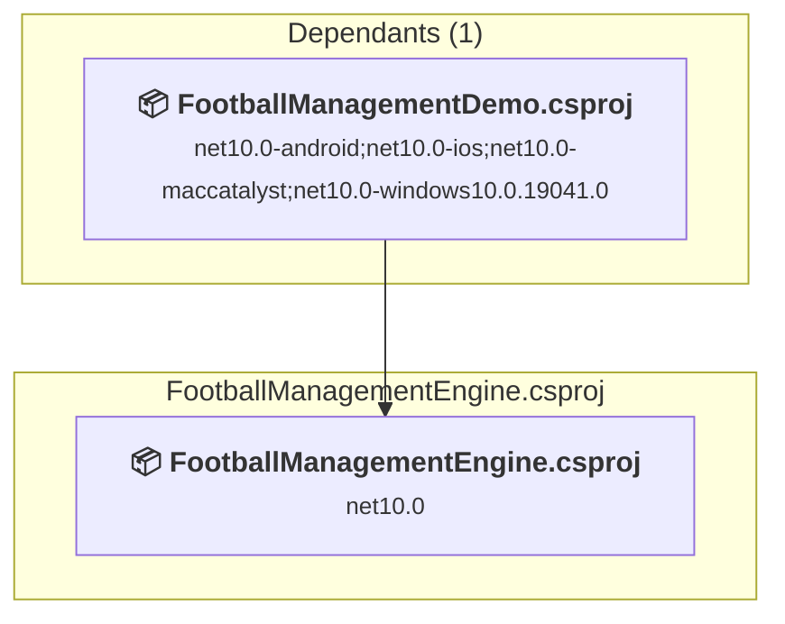

# Projects and dependencies analysis

This document provides a comprehensive overview of the projects and their dependencies in the context of upgrading to .NETCoreApp,Version=v10.0.

## Table of Contents

- [Executive Summary](#executive-Summary)
  - [Highlevel Metrics](#highlevel-metrics)
  - [Projects Compatibility](#projects-compatibility)
  - [Package Compatibility](#package-compatibility)
  - [API Compatibility](#api-compatibility)
  - [Binding Redirect Configuration](#binding-redirect-configuration)
- [Aggregate NuGet packages details](#aggregate-nuget-packages-details)
- [Top API Migration Challenges](#top-api-migration-challenges)
  - [Technologies and Features](#technologies-and-features)
  - [Most Frequent API Issues](#most-frequent-api-issues)
- [Projects Relationship Graph](#projects-relationship-graph)
- [Project Details](#project-details)

  - [FootballManagementDemo\FootballManagementDemo.csproj](#footballmanagementdemofootballmanagementdemocsproj)
  - [FootballManagementEngine\FootballManagementEngine.csproj](#footballmanagementenginefootballmanagementenginecsproj)

## Executive Summary

### Highlevel Metrics

| Metric | Count | Status |
| :--- | :---: | :--- |
| Total Projects | 2 | 0 require upgrade |
| Total NuGet Packages | 113 | All compatible |
| Total Code Files | 20 |  |
| Total Code Files with Incidents | 0 |  |
| Total Lines of Code | 1199 |  |
| Total Number of Issues | 0 |  |
| Estimated LOC to modify | 0+ | at least 0.0% of codebase |

### Projects Compatibility

| Project | Target Framework | Difficulty | Package Issues | API Issues | Binding Issues | Est. LOC Impact | Description |
| :--- | :---: | :---: | :---: | :---: | :---: | :---: | :--- |
| [FootballManagementDemo\FootballManagementDemo.csproj](#footballmanagementdemofootballmanagementdemocsproj) | net10.0-android;net10.0-ios;net10.0-maccatalyst;net10.0-windows10.0.19041.0 | ✅ None | 0 | 0 | 0 |  | ClassLibrary, Sdk Style = True |
| [FootballManagementEngine\FootballManagementEngine.csproj](#footballmanagementenginefootballmanagementenginecsproj) | net10.0 | ✅ None | 0 | 0 | 0 |  | ClassLibrary, Sdk Style = True |

### Package Compatibility

| Status | Count | Percentage |
| :--- | :---: | :---: |
| ✅ Compatible | 113 | 100.0% |
| ⚠️ Incompatible | 0 | 0.0% |
| 🔄 Upgrade Recommended | 0 | 0.0% |
| ***Total NuGet Packages*** | ***113*** | ***100%*** |

### API Compatibility

| Category | Count | Impact |
| :--- | :---: | :--- |
| 🔴 Binary Incompatible | 0 | High - Require code changes |
| 🟡 Source Incompatible | 0 | Medium - Needs re-compilation and potential conflicting API error fixing |
| 🔵 Behavioral change | 0 | Low - Behavioral changes that may require testing at runtime |
| ✅ Compatible | 0 |  |
| ***Total APIs Analyzed*** | ***0*** |  |

## Aggregate NuGet packages details

| Package | Current Version | Suggested Version | Projects | Description |
| :--- | :---: | :---: | :--- | :--- |
| GoogleGson | 2.13.1.1 |  | [FootballManagementDemo.csproj](#footballmanagementdemofootballmanagementdemocsproj) | ✅Compatible |
| Microsoft.Extensions.Configuration | 10.0.0 |  | [FootballManagementDemo.csproj](#footballmanagementdemofootballmanagementdemocsproj) | ✅Compatible |
| Microsoft.Extensions.Configuration.Abstractions | 10.0.0 |  | [FootballManagementDemo.csproj](#footballmanagementdemofootballmanagementdemocsproj) | ✅Compatible |
| Microsoft.Extensions.DependencyInjection | 10.0.0 |  | [FootballManagementDemo.csproj](#footballmanagementdemofootballmanagementdemocsproj) | ✅Compatible |
| Microsoft.Extensions.DependencyInjection.Abstractions | 10.0.0 |  | [FootballManagementDemo.csproj](#footballmanagementdemofootballmanagementdemocsproj) | ✅Compatible |
| Microsoft.Extensions.Diagnostics.Abstractions | 10.0.0 |  | [FootballManagementDemo.csproj](#footballmanagementdemofootballmanagementdemocsproj) | ✅Compatible |
| Microsoft.Extensions.FileProviders.Abstractions | 10.0.0 |  | [FootballManagementDemo.csproj](#footballmanagementdemofootballmanagementdemocsproj) | ✅Compatible |
| Microsoft.Extensions.Hosting.Abstractions | 10.0.0 |  | [FootballManagementDemo.csproj](#footballmanagementdemofootballmanagementdemocsproj) | ✅Compatible |
| Microsoft.Extensions.Logging | 10.0.0 |  | [FootballManagementDemo.csproj](#footballmanagementdemofootballmanagementdemocsproj) | ✅Compatible |
| Microsoft.Extensions.Logging.Abstractions | 10.0.0 |  | [FootballManagementDemo.csproj](#footballmanagementdemofootballmanagementdemocsproj) | ✅Compatible |
| Microsoft.Extensions.Options | 10.0.0 |  | [FootballManagementDemo.csproj](#footballmanagementdemofootballmanagementdemocsproj) | ✅Compatible |
| Microsoft.Extensions.Primitives | 10.0.0 |  | [FootballManagementDemo.csproj](#footballmanagementdemofootballmanagementdemocsproj) | ✅Compatible |
| Microsoft.Maui.Controls | 10.0.20 |  | [FootballManagementDemo.csproj](#footballmanagementdemofootballmanagementdemocsproj) | ✅Compatible |
| Microsoft.Maui.Controls.Build.Tasks | 10.0.20 |  | [FootballManagementDemo.csproj](#footballmanagementdemofootballmanagementdemocsproj) | ✅Compatible |
| Microsoft.Maui.Controls.Core | 10.0.20 |  | [FootballManagementDemo.csproj](#footballmanagementdemofootballmanagementdemocsproj) | ✅Compatible |
| Microsoft.Maui.Controls.Xaml | 10.0.20 |  | [FootballManagementDemo.csproj](#footballmanagementdemofootballmanagementdemocsproj) | ✅Compatible |
| Microsoft.Maui.Core | 10.0.20 |  | [FootballManagementDemo.csproj](#footballmanagementdemofootballmanagementdemocsproj) | ✅Compatible |
| Microsoft.Maui.Essentials | 10.0.20 |  | [FootballManagementDemo.csproj](#footballmanagementdemofootballmanagementdemocsproj) | ✅Compatible |
| Microsoft.Maui.Graphics | 10.0.20 |  | [FootballManagementDemo.csproj](#footballmanagementdemofootballmanagementdemocsproj) | ✅Compatible |
| Microsoft.Maui.Resizetizer | 10.0.20 |  | [FootballManagementDemo.csproj](#footballmanagementdemofootballmanagementdemocsproj) | ✅Compatible |
| Microsoft.NET.ILLink.Tasks | 10.0.11 |  | [FootballManagementDemo.csproj](#footballmanagementdemofootballmanagementdemocsproj) | ✅Compatible |
| Xamarin.Android.Glide | 4.16.0.14 |  | [FootballManagementDemo.csproj](#footballmanagementdemofootballmanagementdemocsproj) | ✅Compatible |
| Xamarin.Android.Glide.Annotations | 4.16.0.14 |  | [FootballManagementDemo.csproj](#footballmanagementdemofootballmanagementdemocsproj) | ✅Compatible |
| Xamarin.Android.Glide.DiskLruCache | 4.16.0.14 |  | [FootballManagementDemo.csproj](#footballmanagementdemofootballmanagementdemocsproj) | ✅Compatible |
| Xamarin.Android.Glide.GifDecoder | 4.16.0.14 |  | [FootballManagementDemo.csproj](#footballmanagementdemofootballmanagementdemocsproj) | ✅Compatible |
| Xamarin.AndroidX.Activity | 1.10.1.3 |  | [FootballManagementDemo.csproj](#footballmanagementdemofootballmanagementdemocsproj) | ✅Compatible |
| Xamarin.AndroidX.Activity.Ktx | 1.10.1.3 |  | [FootballManagementDemo.csproj](#footballmanagementdemofootballmanagementdemocsproj) | ✅Compatible |
| Xamarin.AndroidX.Annotation | 1.9.1.5 |  | [FootballManagementDemo.csproj](#footballmanagementdemofootballmanagementdemocsproj) | ✅Compatible |
| Xamarin.AndroidX.Annotation.Experimental | 1.5.1.1 |  | [FootballManagementDemo.csproj](#footballmanagementdemofootballmanagementdemocsproj) | ✅Compatible |
| Xamarin.AndroidX.Annotation.Jvm | 1.9.1.5 |  | [FootballManagementDemo.csproj](#footballmanagementdemofootballmanagementdemocsproj) | ✅Compatible |
| Xamarin.AndroidX.AppCompat | 1.7.1.1 |  | [FootballManagementDemo.csproj](#footballmanagementdemofootballmanagementdemocsproj) | ✅Compatible |
| Xamarin.AndroidX.AppCompat.AppCompatResources | 1.7.1.1 |  | [FootballManagementDemo.csproj](#footballmanagementdemofootballmanagementdemocsproj) | ✅Compatible |
| Xamarin.AndroidX.Arch.Core.Common | 2.2.0.18 |  | [FootballManagementDemo.csproj](#footballmanagementdemofootballmanagementdemocsproj) | ✅Compatible |
| Xamarin.AndroidX.Arch.Core.Runtime | 2.2.0.18 |  | [FootballManagementDemo.csproj](#footballmanagementdemofootballmanagementdemocsproj) | ✅Compatible |
| Xamarin.AndroidX.Browser | 1.8.0.11 |  | [FootballManagementDemo.csproj](#footballmanagementdemofootballmanagementdemocsproj) | ✅Compatible |
| Xamarin.AndroidX.CardView | 1.0.0.36 |  | [FootballManagementDemo.csproj](#footballmanagementdemofootballmanagementdemocsproj) | ✅Compatible |
| Xamarin.AndroidX.Collection | 1.5.0.3 |  | [FootballManagementDemo.csproj](#footballmanagementdemofootballmanagementdemocsproj) | ✅Compatible |
| Xamarin.AndroidX.Collection.Jvm | 1.5.0.3 |  | [FootballManagementDemo.csproj](#footballmanagementdemofootballmanagementdemocsproj) | ✅Compatible |
| Xamarin.AndroidX.Collection.Ktx | 1.5.0.3 |  | [FootballManagementDemo.csproj](#footballmanagementdemofootballmanagementdemocsproj) | ✅Compatible |
| Xamarin.AndroidX.Concurrent.Futures | 1.3.0.1 |  | [FootballManagementDemo.csproj](#footballmanagementdemofootballmanagementdemocsproj) | ✅Compatible |
| Xamarin.AndroidX.ConstraintLayout | 2.2.1.3 |  | [FootballManagementDemo.csproj](#footballmanagementdemofootballmanagementdemocsproj) | ✅Compatible |
| Xamarin.AndroidX.ConstraintLayout.Core | 1.1.1.3 |  | [FootballManagementDemo.csproj](#footballmanagementdemofootballmanagementdemocsproj) | ✅Compatible |
| Xamarin.AndroidX.CoordinatorLayout | 1.3.0.3 |  | [FootballManagementDemo.csproj](#footballmanagementdemofootballmanagementdemocsproj) | ✅Compatible |
| Xamarin.AndroidX.Core | 1.16.0.3 |  | [FootballManagementDemo.csproj](#footballmanagementdemofootballmanagementdemocsproj) | ✅Compatible |
| Xamarin.AndroidX.Core.Core.Ktx | 1.16.0.3 |  | [FootballManagementDemo.csproj](#footballmanagementdemofootballmanagementdemocsproj) | ✅Compatible |
| Xamarin.AndroidX.Core.ViewTree | 1.0.0.3 |  | [FootballManagementDemo.csproj](#footballmanagementdemofootballmanagementdemocsproj) | ✅Compatible |
| Xamarin.AndroidX.CursorAdapter | 1.0.0.34 |  | [FootballManagementDemo.csproj](#footballmanagementdemofootballmanagementdemocsproj) | ✅Compatible |
| Xamarin.AndroidX.CustomView | 1.2.0.1 |  | [FootballManagementDemo.csproj](#footballmanagementdemofootballmanagementdemocsproj) | ✅Compatible |
| Xamarin.AndroidX.CustomView.PoolingContainer | 1.1.0.1 |  | [FootballManagementDemo.csproj](#footballmanagementdemofootballmanagementdemocsproj) | ✅Compatible |
| Xamarin.AndroidX.DrawerLayout | 1.2.0.18 |  | [FootballManagementDemo.csproj](#footballmanagementdemofootballmanagementdemocsproj) | ✅Compatible |
| Xamarin.AndroidX.DynamicAnimation | 1.1.0.3 |  | [FootballManagementDemo.csproj](#footballmanagementdemofootballmanagementdemocsproj) | ✅Compatible |
| Xamarin.AndroidX.Emoji2 | 1.5.0.6 |  | [FootballManagementDemo.csproj](#footballmanagementdemofootballmanagementdemocsproj) | ✅Compatible |
| Xamarin.AndroidX.Emoji2.ViewsHelper | 1.5.0.6 |  | [FootballManagementDemo.csproj](#footballmanagementdemofootballmanagementdemocsproj) | ✅Compatible |
| Xamarin.AndroidX.ExifInterface | 1.4.1.1 |  | [FootballManagementDemo.csproj](#footballmanagementdemofootballmanagementdemocsproj) | ✅Compatible |
| Xamarin.AndroidX.Fragment | 1.8.8.1 |  | [FootballManagementDemo.csproj](#footballmanagementdemofootballmanagementdemocsproj) | ✅Compatible |
| Xamarin.AndroidX.Fragment.Ktx | 1.8.8.1 |  | [FootballManagementDemo.csproj](#footballmanagementdemofootballmanagementdemocsproj) | ✅Compatible |
| Xamarin.AndroidX.Interpolator | 1.0.0.34 |  | [FootballManagementDemo.csproj](#footballmanagementdemofootballmanagementdemocsproj) | ✅Compatible |
| Xamarin.AndroidX.Lifecycle.Common | 2.9.2.1 |  | [FootballManagementDemo.csproj](#footballmanagementdemofootballmanagementdemocsproj) | ✅Compatible |
| Xamarin.AndroidX.Lifecycle.Common.Jvm | 2.9.2.1 |  | [FootballManagementDemo.csproj](#footballmanagementdemofootballmanagementdemocsproj) | ✅Compatible |
| Xamarin.AndroidX.Lifecycle.LiveData | 2.9.2.1 |  | [FootballManagementDemo.csproj](#footballmanagementdemofootballmanagementdemocsproj) | ✅Compatible |
| Xamarin.AndroidX.Lifecycle.LiveData.Core | 2.9.2.1 |  | [FootballManagementDemo.csproj](#footballmanagementdemofootballmanagementdemocsproj) | ✅Compatible |
| Xamarin.AndroidX.Lifecycle.LiveData.Core.Ktx | 2.9.2.1 |  | [FootballManagementDemo.csproj](#footballmanagementdemofootballmanagementdemocsproj) | ✅Compatible |
| Xamarin.AndroidX.Lifecycle.Process | 2.9.2.1 |  | [FootballManagementDemo.csproj](#footballmanagementdemofootballmanagementdemocsproj) | ✅Compatible |
| Xamarin.AndroidX.Lifecycle.Runtime | 2.9.2.1 |  | [FootballManagementDemo.csproj](#footballmanagementdemofootballmanagementdemocsproj) | ✅Compatible |
| Xamarin.AndroidX.Lifecycle.Runtime.Android | 2.9.2.1 |  | [FootballManagementDemo.csproj](#footballmanagementdemofootballmanagementdemocsproj) | ✅Compatible |
| Xamarin.AndroidX.Lifecycle.Runtime.Ktx | 2.9.2.1 |  | [FootballManagementDemo.csproj](#footballmanagementdemofootballmanagementdemocsproj) | ✅Compatible |
| Xamarin.AndroidX.Lifecycle.Runtime.Ktx.Android | 2.9.2.1 |  | [FootballManagementDemo.csproj](#footballmanagementdemofootballmanagementdemocsproj) | ✅Compatible |
| Xamarin.AndroidX.Lifecycle.ViewModel | 2.9.2.1 |  | [FootballManagementDemo.csproj](#footballmanagementdemofootballmanagementdemocsproj) | ✅Compatible |
| Xamarin.AndroidX.Lifecycle.ViewModel.Android | 2.9.2.1 |  | [FootballManagementDemo.csproj](#footballmanagementdemofootballmanagementdemocsproj) | ✅Compatible |
| Xamarin.AndroidX.Lifecycle.ViewModel.Ktx | 2.9.2.1 |  | [FootballManagementDemo.csproj](#footballmanagementdemofootballmanagementdemocsproj) | ✅Compatible |
| Xamarin.AndroidX.Lifecycle.ViewModelSavedState | 2.9.2.1 |  | [FootballManagementDemo.csproj](#footballmanagementdemofootballmanagementdemocsproj) | ✅Compatible |
| Xamarin.AndroidX.Lifecycle.ViewModelSavedState.Android | 2.9.2.1 |  | [FootballManagementDemo.csproj](#footballmanagementdemofootballmanagementdemocsproj) | ✅Compatible |
| Xamarin.AndroidX.Loader | 1.1.0.34 |  | [FootballManagementDemo.csproj](#footballmanagementdemofootballmanagementdemocsproj) | ✅Compatible |
| Xamarin.AndroidX.Navigation.Common | 2.9.2.1 |  | [FootballManagementDemo.csproj](#footballmanagementdemofootballmanagementdemocsproj) | ✅Compatible |
| Xamarin.AndroidX.Navigation.Common.Android | 2.9.2.1 |  | [FootballManagementDemo.csproj](#footballmanagementdemofootballmanagementdemocsproj) | ✅Compatible |
| Xamarin.AndroidX.Navigation.Fragment | 2.9.2.1 |  | [FootballManagementDemo.csproj](#footballmanagementdemofootballmanagementdemocsproj) | ✅Compatible |
| Xamarin.AndroidX.Navigation.Runtime | 2.9.2.1 |  | [FootballManagementDemo.csproj](#footballmanagementdemofootballmanagementdemocsproj) | ✅Compatible |
| Xamarin.AndroidX.Navigation.Runtime.Android | 2.9.2.1 |  | [FootballManagementDemo.csproj](#footballmanagementdemofootballmanagementdemocsproj) | ✅Compatible |
| Xamarin.AndroidX.Navigation.UI | 2.9.2.1 |  | [FootballManagementDemo.csproj](#footballmanagementdemofootballmanagementdemocsproj) | ✅Compatible |
| Xamarin.AndroidX.ProfileInstaller.ProfileInstaller | 1.4.1.5 |  | [FootballManagementDemo.csproj](#footballmanagementdemofootballmanagementdemocsproj) | ✅Compatible |
| Xamarin.AndroidX.RecyclerView | 1.4.0.3 |  | [FootballManagementDemo.csproj](#footballmanagementdemofootballmanagementdemocsproj) | ✅Compatible |
| Xamarin.AndroidX.ResourceInspection.Annotation | 1.0.1.22 |  | [FootballManagementDemo.csproj](#footballmanagementdemofootballmanagementdemocsproj) | ✅Compatible |
| Xamarin.AndroidX.SavedState | 1.3.1.1 |  | [FootballManagementDemo.csproj](#footballmanagementdemofootballmanagementdemocsproj) | ✅Compatible |
| Xamarin.AndroidX.SavedState.SavedState.Android | 1.3.1.1 |  | [FootballManagementDemo.csproj](#footballmanagementdemofootballmanagementdemocsproj) | ✅Compatible |
| Xamarin.AndroidX.SavedState.SavedState.Ktx | 1.3.1.1 |  | [FootballManagementDemo.csproj](#footballmanagementdemofootballmanagementdemocsproj) | ✅Compatible |
| Xamarin.AndroidX.Security.SecurityCrypto | 1.1.0.4-alpha07 |  | [FootballManagementDemo.csproj](#footballmanagementdemofootballmanagementdemocsproj) | ✅Compatible |
| Xamarin.AndroidX.SlidingPaneLayout | 1.2.0.22 |  | [FootballManagementDemo.csproj](#footballmanagementdemofootballmanagementdemocsproj) | ✅Compatible |
| Xamarin.AndroidX.Startup.StartupRuntime | 1.2.0.5 |  | [FootballManagementDemo.csproj](#footballmanagementdemofootballmanagementdemocsproj) | ✅Compatible |
| Xamarin.AndroidX.SwipeRefreshLayout | 1.1.0.29 |  | [FootballManagementDemo.csproj](#footballmanagementdemofootballmanagementdemocsproj) | ✅Compatible |
| Xamarin.AndroidX.Tracing.Tracing | 1.3.0.1 |  | [FootballManagementDemo.csproj](#footballmanagementdemofootballmanagementdemocsproj) | ✅Compatible |
| Xamarin.AndroidX.Tracing.Tracing.Android | 1.3.0.1 |  | [FootballManagementDemo.csproj](#footballmanagementdemofootballmanagementdemocsproj) | ✅Compatible |
| Xamarin.AndroidX.Transition | 1.6.0.1 |  | [FootballManagementDemo.csproj](#footballmanagementdemofootballmanagementdemocsproj) | ✅Compatible |
| Xamarin.AndroidX.VectorDrawable | 1.2.0.8 |  | [FootballManagementDemo.csproj](#footballmanagementdemofootballmanagementdemocsproj) | ✅Compatible |
| Xamarin.AndroidX.VectorDrawable.Animated | 1.2.0.8 |  | [FootballManagementDemo.csproj](#footballmanagementdemofootballmanagementdemocsproj) | ✅Compatible |
| Xamarin.AndroidX.VersionedParcelable | 1.2.1.3 |  | [FootballManagementDemo.csproj](#footballmanagementdemofootballmanagementdemocsproj) | ✅Compatible |
| Xamarin.AndroidX.ViewPager | 1.1.0.4 |  | [FootballManagementDemo.csproj](#footballmanagementdemofootballmanagementdemocsproj) | ✅Compatible |
| Xamarin.AndroidX.ViewPager2 | 1.1.0.8 |  | [FootballManagementDemo.csproj](#footballmanagementdemofootballmanagementdemocsproj) | ✅Compatible |
| Xamarin.AndroidX.Window | 1.4.0.1 |  | [FootballManagementDemo.csproj](#footballmanagementdemofootballmanagementdemocsproj) | ✅Compatible |
| Xamarin.AndroidX.Window.WindowCore | 1.4.0.1 |  | [FootballManagementDemo.csproj](#footballmanagementdemofootballmanagementdemocsproj) | ✅Compatible |
| Xamarin.AndroidX.Window.WindowCore.Jvm | 1.4.0.1 |  | [FootballManagementDemo.csproj](#footballmanagementdemofootballmanagementdemocsproj) | ✅Compatible |
| Xamarin.Google.Android.Material | 1.12.0.5 |  | [FootballManagementDemo.csproj](#footballmanagementdemofootballmanagementdemocsproj) | ✅Compatible |
| Xamarin.Google.Code.FindBugs.JSR305 | 3.0.2.21 |  | [FootballManagementDemo.csproj](#footballmanagementdemofootballmanagementdemocsproj) | ✅Compatible |
| Xamarin.Google.Crypto.Tink.Android | 1.18.0.1 |  | [FootballManagementDemo.csproj](#footballmanagementdemofootballmanagementdemocsproj) | ✅Compatible |
| Xamarin.Google.ErrorProne.Annotations | 2.41.0.1 |  | [FootballManagementDemo.csproj](#footballmanagementdemofootballmanagementdemocsproj) | ✅Compatible |
| Xamarin.Google.Guava.ListenableFuture | 1.0.0.29 |  | [FootballManagementDemo.csproj](#footballmanagementdemofootballmanagementdemocsproj) | ✅Compatible |
| Xamarin.Jetbrains.Annotations | 26.0.2.3 |  | [FootballManagementDemo.csproj](#footballmanagementdemofootballmanagementdemocsproj) | ✅Compatible |
| Xamarin.JSpecify | 1.0.0.4 |  | [FootballManagementDemo.csproj](#footballmanagementdemofootballmanagementdemocsproj) | ✅Compatible |
| Xamarin.Kotlin.StdLib | 2.2.0.1 |  | [FootballManagementDemo.csproj](#footballmanagementdemofootballmanagementdemocsproj) | ✅Compatible |
| Xamarin.KotlinX.Coroutines.Android | 1.10.2.1 |  | [FootballManagementDemo.csproj](#footballmanagementdemofootballmanagementdemocsproj) | ✅Compatible |
| Xamarin.KotlinX.Coroutines.Core | 1.10.2.1 |  | [FootballManagementDemo.csproj](#footballmanagementdemofootballmanagementdemocsproj) | ✅Compatible |
| Xamarin.KotlinX.Coroutines.Core.Jvm | 1.10.2.1 |  | [FootballManagementDemo.csproj](#footballmanagementdemofootballmanagementdemocsproj) | ✅Compatible |
| Xamarin.KotlinX.Serialization.Core | 1.9.0.1 |  | [FootballManagementDemo.csproj](#footballmanagementdemofootballmanagementdemocsproj) | ✅Compatible |
| Xamarin.KotlinX.Serialization.Core.Jvm | 1.9.0.1 |  | [FootballManagementDemo.csproj](#footballmanagementdemofootballmanagementdemocsproj) | ✅Compatible |

## Top API Migration Challenges

### Technologies and Features

| Technology | Issues | Percentage | Migration Path |
| :--- | :---: | :---: | :--- |

### Most Frequent API Issues

| API | Count | Percentage | Category |
| :--- | :---: | :---: | :--- |

## Projects Relationship Graph

Legend:
📦 SDK-style project
⚙️ Classic project

## Project Details

### FootballManagementDemo\FootballManagementDemo.csproj

#### Project Info

- **Current Target Framework:** net10.0-android;net10.0-ios;net10.0-maccatalyst;net10.0-windows10.0.19041.0✅
- **SDK-style**: True
- **Project Kind:** ClassLibrary
- **Dependencies**: 1
- **Dependants**: 0
- **Number of Files**: 10
- **Lines of Code**: 288
- **Estimated LOC to modify**: 0+ (at least 0.0% of the project)

#### Dependency Graph

Legend:
📦 SDK-style project
⚙️ Classic project

### API Compatibility

| Category | Count | Impact |
| :--- | :---: | :--- |
| 🔴 Binary Incompatible | 0 | High - Require code changes |
| 🟡 Source Incompatible | 0 | Medium - Needs re-compilation and potential conflicting API error fixing |
| 🔵 Behavioral change | 0 | Low - Behavioral changes that may require testing at runtime |
| ✅ Compatible | 0 |  |
| ***Total APIs Analyzed*** | ***0*** |  |

### FootballManagementEngine\FootballManagementEngine.csproj

#### Project Info

- **Current Target Framework:** net10.0✅
- **SDK-style**: True
- **Project Kind:** ClassLibrary
- **Dependencies**: 0
- **Dependants**: 1
- **Number of Files**: 10
- **Lines of Code**: 911
- **Estimated LOC to modify**: 0+ (at least 0.0% of the project)

#### Dependency Graph

Legend:
📦 SDK-style project
⚙️ Classic project

### API Compatibility

| Category | Count | Impact |
| :--- | :---: | :--- |
| 🔴 Binary Incompatible | 0 | High - Require code changes |
| 🟡 Source Incompatible | 0 | Medium - Needs re-compilation and potential conflicting API error fixing |
| 🔵 Behavioral change | 0 | Low - Behavioral changes that may require testing at runtime |
| ✅ Compatible | 0 |  |
| ***Total APIs Analyzed*** | ***0*** |  |

